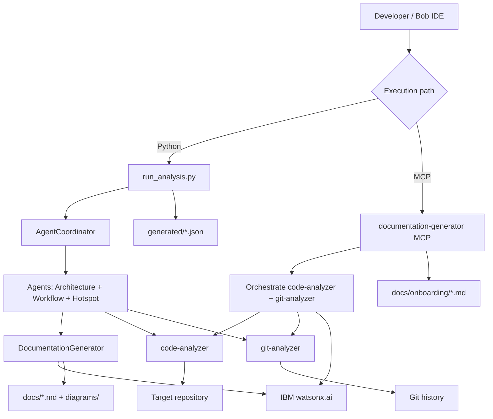

# RepoRadar

**RepoRadar** is an AI-powered legacy codebase onboarding accelerator. It combines Python multi-agent orchestration, MCP servers, and IBM watsonx.ai to generate onboarding documentation grounded in real repository and git evidence.

## Core capabilities

- Analyze repository structure, entry points, dependencies, and complexity
- Detect hotspots from git history + code complexity signals
- Generate onboarding artifacts with GitHub-renderable Mermaid diagrams
- Support two execution paths:
  - **Python pipeline** (`run_analysis.py`, `scripts/onboard_runner.py`)
  - **MCP-native documentation generation** (`documentation-generator` server)

## Architecture



## Tech stack

- Python 3.9+
- Node.js 18+ and npm 9+
- IBM watsonx.ai (`ibm-watsonx-ai`, `@ibm-cloud/watsonx-ai`)
- Model Context Protocol (MCP)

## Repository structure

```text
.
├── config/                            # watsonx configuration
├── orchestrate/                       # Agent definitions (agents.yaml)
├── scripts/
│   └── onboard_runner.py              # Bob-callable onboarding pipeline
├── src/
│   ├── agents/                        # Python agents + coordinator + MCP client
│   ├── dashboard/                     # Dashboard module (currently minimal)
│   └── mcp-servers/                   # code-analyzer, git-analyzer, documentation-generator
├── tests/                             # Python tests (diagram utils)
├── generated/                         # JSON outputs (analysis + graphs)
├── main.py                            # Environment readiness check
├── run_analysis.py                    # Main Python analysis CLI
├── test_watsonx.py                    # watsonx connection test
└── requirements.txt
```

## Setup

1. Install Python dependencies:

```bash
python -m venv .venv
# Windows PowerShell:
.venv\Scripts\Activate.ps1
# macOS/Linux:
# source .venv/bin/activate
pip install -r requirements.txt
```

2. Install and build MCP servers:

```bash
cd src/mcp-servers
npm install
npm run build
cd ../..
```

3. Configure environment variables (`.env` from `.env.example`):

```env
WATSONX_API_KEY=your_watsonx_api_key_here
WATSONX_PROJECT_ID=your_project_id_here
```

Optional:

```env
WATSONX_MODEL_ID=openai/gpt-oss-120b
WATSONX_MAX_TOKENS=2000
WATSONX_TEMPERATURE=0.2
WATSONX_TOP_P=0.9
```

## Usage

Validate environment:

```bash
python main.py
python test_watsonx.py
```

Run Python orchestration pipeline:

```bash
python run_analysis.py --repo-path . --output-dir docs --parallel
```

Run Bob-oriented onboarding pipeline:

```bash
python scripts/onboard_runner.py --repo-path . --output-dir docs
```

## Output artifacts

- **Python pipeline** typically generates:
  - `docs/ONBOARDING.md`
  - `docs/ARCHITECTURE.md`
  - `docs/WORKFLOWS.md`
  - `docs/diagrams/*.mmd`
  - `generated/analysis.json`, `generated/dependency_graph.json`, `generated/refactoring_priorities.json`
- **MCP-native package generation** (`documentation-generator.generate_onboarding_package`) generates:
  - `ONBOARDING_GUIDE.md`, `API_REFERENCE.md`, `FAQ.md`
  - `ARCHITECTURE.md`, `WORKFLOWS.md`, `HOTSPOTS.md`
  - Mermaid `.mmd` diagrams in `diagrams/`

## License

MIT
